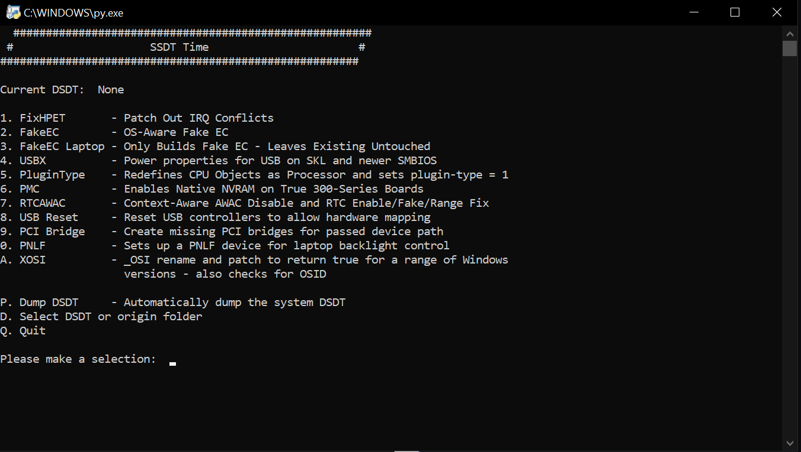

# SSDTs: The easy way

So here we'll be using a super simple tool made by CorpNewt: [SSDTTime](https://github.com/corpnewt/SSDTTime)
The purpose of this tool is to extract your DSDT from your firmware and generate SSDTs using it. Please note that this process can only be done on machines running either Windows or Linux.

## So what **CAN'T** SSDTTime do

* **SSDT-GPI0**:
  * Need to be configured to your system

* **IMEI SSDT**:
  * If you have either a Sandy Bridge CPU with a 7 series motherboard or Ivy Bridge with a 6 series motherboard, you'll need to either use the prebuilt or manually create it.

* **RTC0 RANGE SSDT**:
  * If you have X99 or X299, you'll need to configure it to your system.

For users who don't have all the options available to them in SSDTTime, you can follow the "SSDTs: The long way" section. You can still use SSDTTime for SSDTs it does support.

## Running SSDTTime

Run the `SSDTTime.bat` file as Admin on the target machine and you should see something like this:

What are all these options?:

* `1. FixHPET `
	* Patch Out IRQ Conflicts
* `2. FakeEC`
	* OS-Aware Fake EC
* `3. FakeEC Laptop`
 	* Only Builds Fake EC - Leaves Existing Untouched
* `4. USBX`
	* Power properties for USB on SKL and newer SMBIOS
* `5. PluginType`
	* Redefines CPU Objects as Processor and sets plugin-type = 1`
* `6. PMC `
	* Enables Native NVRAM on True 300-Series Boards`
* `7. RTCAWAC`
	* Context-Aware AWAC Disable and RTC Enable/Fake/Range Fix`
* `8. USB Reset`
	* Reset USB controllers to allow hardware mapping`
* `9. PCI Bridge`
	* Create missing PCI bridges for passed device path`
* `0. PNLF`
	* Sets up a PNLF device for laptop backlight control`
* `A. XOSI `
	* _OSI rename and patch to return true for a range of Windows versions - also checks for OSID
* P. `Dump DSDT`
	* Automatically dump the system DSDT

What we want to do is select the option `P. Dump DSDT` first, then select the appropriate option(s) for your system.

**Troubleshooting note**: See [General Troubleshooting](https://dortania.github.io/OpenCore-Install-Guide/troubleshooting/troubleshooting.html) if you're having issues running SSDTTime

## Adding to OpenCore

Don't forget that SSDTs need to be added to OpenCore, a reminder that .aml is compiled, and .dsl is code. **Add only the .aml file**:

* EFI/OC/ACPI
* config.plist -> ACPI -> Add

A reminder that Cmd/Ctrl+R with ProperTree pointed at your OC folder will add all your SSDTs, kexts, and .efi drivers to the config for you. **Do not add your DSDT to OpenCore, it's already in your firmware**. If you are unsure what this is referring to, go back to the OpenCore guide and select your config based on the architecture of your CPU.

If you haven't made a config.plist yet, you should go back to the OpenCore guide and make one.

* [OpenCore Install guide](https://dortania.github.io/OpenCore-Install-Guide/)

Users of `FixHPET` will also need to merge oc_patches.plist into their config.plist

To accomplish this task, follow these steps:
1. Open both files.
2. Remove the `ACPI -> Patch` section from the config.plist file.
3. Copy the `ACPI -> Patch` section from the patches.plist file.
4. Paste it in the location where the old patches were in the config.plist file.
